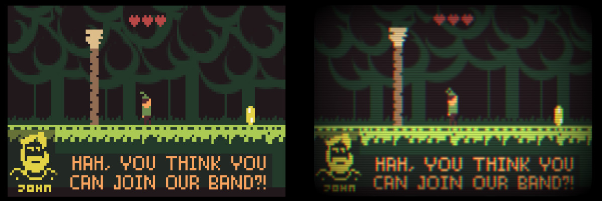
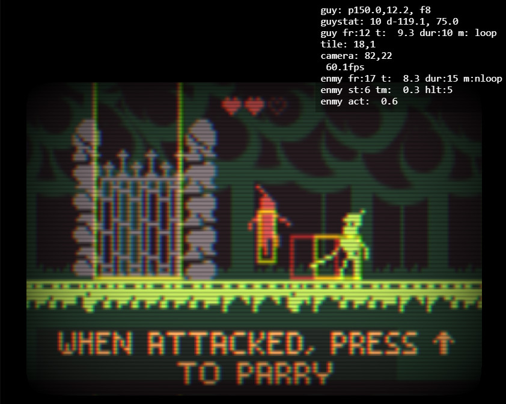

# Robin of Thirteensley

> The year is Nineteen Seventy Thirteen. The personal computer craze is just starting to really take off, and the most popular computers sold are... video games consoles. Inspired minds around the globe are racing to invent the future, and hungry corporations are eager to fund them.
> You're a streetwise 13 year old, browsing casually through the broad aisles of ToysRSus, when you turn the corner into the gaming isle and there it is: Robin of Thirteensley, running on a demo station. The gigantic 13kb cartridge, you learn from the prominently placed sticker, hosts untold adventure; basically the most realistic video game ever made. Your world narrows into focus: You. Must. Play. This game.

Robin of Thirteensley is a tiny vintage adventure game made for the [JS13K](https://js13kgames.com/) competition in 2023. As the name suggests, the competition is about writing a game in just 13Kb of JavaScript code.

You can [play the game in your browser!](https://csubagio.github.io/js13k-robin/index.html). As of this writing in 2023, it's pretty standard web fare: Canvas 2D + WebGL + WebAudio, with an AudioWorker. This should run in most desktop browsers. It'll run on mobile, but the controls aren't set up for it: you must have a keyboard.

## Graphics

My goal this year was to create a miniature game, with miniaturized versions of traditional processes from the early days of gaming. I initially focused on hand animated pixel art sprites. I ended up animating them in Aseprite, and then exporting those to packed 1bit (almost everything) or 2bit (the player sprite), Base64 encoded buffers, which I unpack into OffscreenCanvas elements in the browser. The game has a single palette, so that could be omitted from individual sprites. I started with the [aseprite npm package](https://github.com/wavetilt/node-aseprite) that handily already parsed the Aseprite file format. I wrote a script that extracted the palette from one file, and then one by one extracted the bit planes.

Aseprite supports the concept of "tags," which are named time regions in an Aseprite file. So you can, e.g. work in one file, but name subregions "run", "idle", etc. These are super handy to streamline development, letting you set animations without worrying about where they start or how many frames they should run, but in a 13k project, even these tiny string names are a burden. So instead of exporting the usual dictionary of string to tag metadata, for this project I just exported them as code, alongside the Base64 image data. This meant that I could refer to the tags from game code using variable identifiers, and the minifier could throw those all out and replace them with single characters. This worked out very nicely, and as a bonus, Visual Studio Code also provided auto completion for the tag names! You can see what this ends up looking like, in the [data.ts file](game/data.ts). 

I added a file watch to the [sprite export script](tools/spriter.ts), and so after an aseprite file was intially added to the script, I could edit the animation, save, and then tab over to the browser and just reload to see the results. Really smooth. Almost everything you see in the game is one of these sprites, even the font is just an Aseprite file with a frame for each glyph between ASCII 33 and 94, which is the numbers, upper case letters, and a few extra glyphs. I recycled some codepoints that I wasn't otherwise using to be the GUI hearts, and arrow inputs for the instructions. Even with the huge overhead of storing width/height/offsets and a color for each frame, the entire font ended up being just 830 bytes. Next year I think I'll special case it and see how far down it can go. Here's this year's font:

> "AAABBgoBBS8AAAQDCgEFqgUAAAYGCgEFDMO0HgMAAAUFCgEG6n9HAAAABQUKAQeqRkUAAAAEBgoBBVKltQAAAgIKAQUGAAADBgoBBVQiAgAAAwYKAQURqQAAAAQGCgEF////AAIDAwoBBboAAAQCAgoBBQYAAwMBCgEFBwAFAQEKAQUBAAADBgoBBaSUAAAAAwYKAQVqWwEAAAMGCgEFk6QDAAADBgoBBaOTAwAAAwYKAQWjyAEAAAMGCgEFrUkCAAADBgoBBc/IAQAAAwYKAQXOWgEAAAMGCgEFJ0kCAAADBgoBBapaAQAAAwYKAQWqyQEAAQEECgEFCQABAQUKAQUZAAAFBgoBBUT8LwgAAQMDCgEFxwEAAAUGCgEFBP2PCAAAAwYKAQUvBQEAAAQGCgEFn93xAAAEBgoBBZf5mQAABAYKAQWXefkAAAQGCgEFHhHhAAAEBgoBBZeZeQAABAYKAQUfF/EAAAQGCgEFHxcRAAAEBgoBBR6deQAABAYKAQWZn5kAAAMGCgEFl6QDAAADBgoBBSbZAwAABAYKAQWZNZUAAAQGCgEFERHxAAAFBgoBBXHXWisAAAUGCgEFcdaaIwAABQYKAQUuxhgdAAAEBgoBBZd5EQAABQYKAQUuxpgsAAAEBgoBBZd5mQAABAYKAQUeYfgAAAUGCgEFnxBCCAAABAYKAQWZmWkAAAUGCgEFMSpFCAAABQYKAQUxxlodAAAFBgoBBVERoiIAAAUGCgEFMUZHCAAABAYKAQXPJPMAAAMGCgEFT5IDAAADBgoBBYlEAgAAAwYKAQUnyQMAAAYGCgEFjNcyDAM="

I'm very pleased with the way the sprites came out, but they're otherwise technically uninteresting: just plain bitmaps. The only procedural art in the game is the background trees. I had concepted these big crescent shapes, but even with all the compression going on they were just too huge. So those ended up being created on an offscreen canvas out of a rectangle and a series of spiraling circles of alternating color.

As the game progressed, it was feeling more and more retro nostalgic, so I decided to lean in and spend some bytes on a nice exaggerated 80s filter. 

The filter is a WebGL shader, which makes it a bit chunky, ~600bytes for the look, including all the WebGL boilerplate. The irony is that I wrote the rest of the game in Canvas 2D thinking I didn't want to spend the bytes on initializing WebGL this year, and here we are. I added it on a whim and it looked good though, so in it stayed. The actual effect is pretty trivial: I feed the completed canvas 2D into WebGL as a texture, and let it get bilinear filtered. That produces the initial blurriness. On top of that I add the scanlines with a sin wave that tiles the same number of times as the pixel height. To get the halation, I just sum 3 different texture reads of the same canvas, but offset slightly left and right; the left version is multiplied by red and the right is multipled by blue. Add a vignette on top to dim the edges and trim the rounded rect, and we're done.

## Code

This project is largely written in TypeScript. I find the type annotations keep me from making simple mistakes, especially when I'm working late night and rushing headlong during a gamejam. They also fuel Visual Studio Code's code completion and refactoring tools, which are a joy to use. I skipped out on modules this time, and just have the basic tsc bundling schema: I specify all the input files in the `tsconfig.json`, in the order I need them to be, and then TypeScript figures out the rest, bundling everything into [a single JavaScript file](game.js).

To streamline development, I have a [local HTML file](game/source.html) that references the JavaScript file that tsc builds directly, and had tsc in `--watch` mode to recompile whenever I saved a code file. This was fast enough that by the time I'd tabbed over to the browser and hit reload, it was ready. Alongside that, another script loaded the JS, ran it through the [Terser mangler/minifier](https://terser.org/), and [roadroller compressor](https://github.com/lifthrasiir/roadroller), and then substituted it into the HTML file to produce the final [game.html](game.html) and [game.zip](game.zip) files. It also printed out the size of the final zip for me to sweat over. This forked approach let me iterate quickly on the source HTML file, while keeping an eye on the background process' output to see where I was. Occassionaly I'd load the minified version as well, and would sadly discover the odd minifier error, but otherwise I spent most of the time in the quick iterate source version.

The game code itself isn't super interesting. It's all minimalist traditional gamedev stuff. There's a basic animation class that works with the data loaded from Aseprite. The level is roughly a tilemap, with the setup in [`forest.ts`](game/forest.ts) being hand coded function to fill lines with 8x8 pixel frames from Aseprite. Collision is just simple box tests. The player and enemies are simple state machines.

Speaking of classes though, I decided not to use any this time, principally because as a point of golfing I wanted to avoid using irreducible JavaScript keywords, and member access for classes always needs a `this`. I didn't give up being object oriented where it mattered though, I just wrote it like old C code. So instead of `guy.tick() { this.x += 10 }`, I'd have a `guyTick(guy) { guy.x += 10 }` I did quite a bit of golfing along these lines, looking to avoid as many keywords as possible, so that the minifier could mangle everything down to 1 or 2 letters. At one point I had the build script spit out a [word histogram](keywords.txt) so that I could check in periodically and see what keywords survived the minifier. I'd go back and massage these until they disappeared. There were quite a few unexpected ones, mostly where the minifier was probably being conservative with member names that commonly appear on DOM objects, e.g. `width` and `height`. This is why my final code has members like `wdth` and `hght` :) 

Because I was generally testing in the source rather than packed version of the game, I could rely on the browser debugger to tell me useful things. For example if a bit of code crashed, it'd still be obvious which function I was in, and the data would all still be labeled with human friendly names. To help debug constantly changing values, I added a heads up display with some key data. I had a div that displayed things like the player position and enemy states, and a graphical overlay depicting all the rectangles used for logic intersection tests. This was enough support that I was basically never stumped: if a problem reared its ugly head, it would be obvious where it was, as soon as I started playing.

## Sound

I was initially going to do some traditional chiptune sound design, but fell down a Karplus-Strong rabbit hole instead, and so the all sounds come from a pair of acoustic sounding guitars synths. They don't fit the retro theme at all, but let's just pretend that the fantasy early 80s console it's playing on had a bizzarely specific string synth built in?

The synths are written as WebAudio worklets and implement the standard ring buffer you'd expect for Karplus-Strong. The main game then posts messages to the worklets to "strum" the individual strings at specific frets. I didn't have a lot of time, so I just transcribed a few open chords, and attached strings to events like the player walking/jumping/lunging. Other events change the current chord, and that's about as far as I got. I do like the sound though, so I am looking forward to doing more with it in some future project. The only technical oddity here might be that I did not want to load a separate JS file for the worklet, and so the code for it is passed into the worklet constructor as a plain text data URL. Turns out this works just fine!

For the curious, you can [play with just the guitar here](https://csubagio.github.io/tiny-guitar/chording.html) At some point I hope to go back and tidy up that repo with just the guitar, so that other folks can experiment too.

## Epilogue

This was a lot of fun. I did not expect to have the free time to pursue it, but the bug bit and ended up eating up a couple of weekends. I'm glad it did, and I hope I get to try again some other year. If you made it all the way down here, thank you for sticking with my rambling, and in case you've also already had a go: thank you for trying my game!

--Chris.
